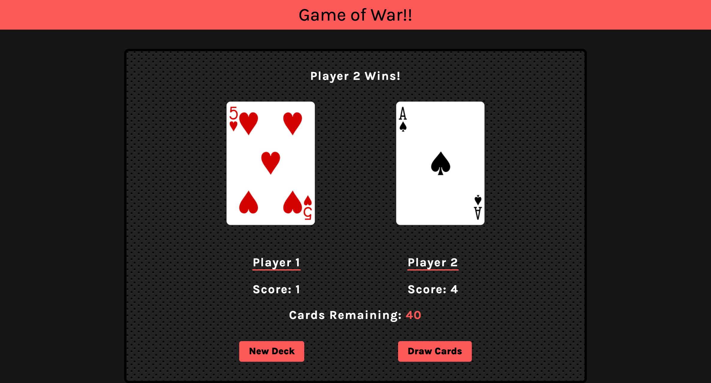

# game-of-war

## Description
This project uses a deck of cards API to get a random card for Player 1 and Player 2. The players can also choose to create a new deck if the game needs to be reset. This project uses HTML, CSS, Javascript, and APIs.

## Usage
[Deployed Application](https://hope428.github.io/game-of-war/)

## Credits

Scrimba  
Toptal for the background pattern

